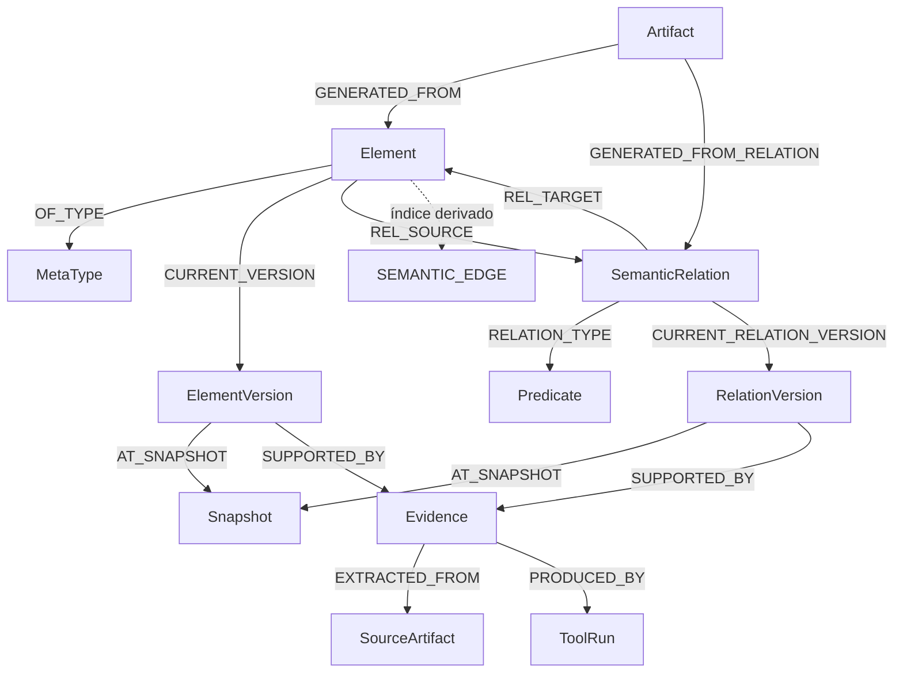

# Modelo de datos en LadybugDB para C4 y UML

**Estado:** diseño propuesto  
**Versión:** 1.0  
**Fecha:** 29 de julio de 2026  
**Base:** una `architecture.lbdb` por proyecto

---

## 1. Objetivo

Persistir un grafo extensible que conecte:

- modelo C4;
- casos de uso;
- diagramas de clases;
- escenarios y diagramas de secuencia;
- código e infraestructura;
- evidencias;
- snapshots;
- diagramas como vistas;
- artefactos renderizados.

El modelo debe permitir esta navegación:

```text
Actor
  → Caso de uso
  → Escenario
  → Interacción
  → Operación
  → Clase
  → Componente
  → Contenedor
  → Sistema
```

---

## 2. Decisiones estructurales

### 2.1 Grafo de propiedades tipado

LadybugDB utiliza tablas de nodos y relaciones con esquema previo. El proyecto utilizará un subgrafo estricto llamado `architecture`.

### 2.2 Metamodelo extensible

El esquema físico no crea una tabla por cada tipo C4 o UML.

Se registran tipos y predicados:

```text
MetaType
Predicate
```

Los objetos se almacenan como:

```text
Element
SemanticRelation
```

### 2.3 Identidad y versión separadas

```text
Element
  = identidad estable

ElementVersion
  = estado del elemento en un snapshot

SemanticRelation
  = identidad estable de una relación

RelationVersion
  = estado de la relación en un snapshot
```

Renombrar un contenedor no obliga a cambiar su identidad.

### 2.4 Relaciones semánticas reificadas

Una relación es un nodo porque necesita:

- ID estable;
- evidencias;
- versiones;
- confianza;
- referencias desde diagramas;
- agregación.

Se mantiene además una arista `SEMANTIC_EDGE` derivada para recorridos eficientes.

---

## 3. Vista global



---

## 4. Tablas de nodos

### 4.1 `MetaType`

Define los tipos disponibles.

Propiedades:

```text
id
namespace
name
category
schema_version
property_schema
validation_rules
renderer_hints
description
```

Ejemplos:

```text
c4.person
c4.software_system
c4.container
c4.component
c4.deployment_node

uml.actor
uml.use_case
uml.class
uml.interface
uml.operation

behavior.scenario
behavior.participant
behavior.interaction
behavior.fragment

view.diagram
view.member
view.edge
view.group
```

### 4.2 `Predicate`

Define relaciones semánticas.

Propiedades:

```text
id
namespace
name
directed
transitive
symmetric
allowed_pairs
property_schema
validation_rules
renderer_hints
```

Ejemplos:

```text
core.contains
core.depends_on
core.uses
core.owns
core.realizes
core.represents

usecase.initiates
usecase.participates_in
usecase.includes
usecase.extends
usecase.realized_by

uml.extends
uml.implements
uml.association
uml.aggregation
uml.composition
uml.accepts
uml.returns

behavior.has_participant
behavior.has_interaction
behavior.sender
behavior.receiver
behavior.invokes
behavior.has_fragment
behavior.has_operand

view.has_member
view.has_edge
view.source
view.target
view.represents
```

### 4.3 `Element`

Identidad canónica.

```text
id
kind_id
category
canonical_key
created_at
```

Ejemplos de ID:

```text
c4:system:orders
c4:container:orders/api
c4:component:orders/api/application

uml:class:orders::CreateOrderHandler
uml:operation:orders::CreateOrderHandler#handle

uml:use-case:orders/create-order
behavior:scenario:orders/create-order/success
```

### 4.4 `ElementVersion`

Estado inmutable en un snapshot:

```text
id
element_id
name
description
status
origin
confidence
order_key
content_hash
props
created_at
```

### 4.5 `SemanticRelation`

Identidad canónica de una relación:

```text
id
predicate_id
source_id
target_id
canonical_key
created_at
```

### 4.6 `RelationVersion`

Estado de la relación:

```text
id
relation_id
label
status
origin
confidence
order_key
content_hash
props
created_at
```

### 4.7 `Snapshot`

```text
id
sequence
kind
commit_hash
worktree_id
schema_version
created_at
props
```

Tipos:

```text
commit
worktree_overlay
manual
imported
checkpoint
```

### 4.8 `Evidence`

```text
id
kind
classification
claim
confidence
path
start_line
end_line
commit_hash
content_hash
tool_name
tool_version
rule_id
props
observed_at
```

Clasificaciones:

```text
observed
derived
inferred
confirmed
contradicted
```

**Nota sobre `props`:** los siguientes campos viven en `Evidence.props` (no como columnas del schema) para evitar `ALTER TABLE`:
- `language` — string, etiqueta del lenguaje
- `start_byte` — número, inicio del rango en bytes
- `end_byte` — número, fin del rango en bytes
- `text_preview` — string, previsualización del texto
- `node_kind` — string, kind del nodo TSG
- `byte_range` — array[2], `[start_byte, end_byte]`
- `source_origin` — string, provenance tag (`"user_workspace"` | `"user_input"` | `"tool_output"`)

### 4.9 `SourceArtifact`

Representa una fuente analizada:

```text
id
kind
relative_path
language
content_hash
commit_hash
generated
props
```

Puede representar:

```text
source_file
configuration
contract
test
trace
documentation
manifest
```

### 4.10 `Evaluation`

Evaluación de una fila de evidencia contra un criterio. Opcional en B1 (D3) — `put_evidence` no requiere una.

```text
id
target_evidence_id
criterion
passed
evaluator
evaluated_at
props
```

- `id`: `"eval:" + blake3(criterion + target_evidence_id + evaluated_at)[..16]`
- `criterion`: nombre del criterio evaluado (`"min_occurrence"` | `"user_accepted"` | ...)
- `passed`: `true` = accept, `false` = reject
- `evaluator`: `"archctl:threshold_v1"` | `"human:<id>"` | ...
- `evaluated_at`: RFC3339 timestamp
- `props`: JSON con `criterion_params`, `observed_value`, `notes` (opcionales)

### 4.11 `ToolRun`

```text
id
tool_name
tool_version
adapter_version
command_hash
configuration_hash
started_at
finished_at
status
props
```

### 4.11 `Artifact`

Metadatos de una fuente o render generado:

```text
id
kind
format
path
content_hash
renderer
renderer_version
status
props
created_at
```

Los binarios y ficheros grandes permanecen fuera de LadybugDB.

### 4.12 `AnalysisRun`

```text
id
request
kind
status
started_at
finished_at
props
```

Permite enlazar una ejecución de OpenCode con snapshots, herramientas y artefactos.

---

## 5. Relaciones físicas

### Metamodelo

```text
Element       -[:OF_TYPE]-> MetaType
SemanticRelation -[:RELATION_TYPE]-> Predicate
```

### Versionado

```text
Element        -[:CURRENT_VERSION]-> ElementVersion
ElementVersion -[:VERSION_OF]-> Element
ElementVersion -[:AT_SNAPSHOT]-> Snapshot

SemanticRelation -[:CURRENT_RELATION_VERSION]-> RelationVersion
RelationVersion  -[:RELATION_VERSION_OF]-> SemanticRelation
RelationVersion  -[:AT_SNAPSHOT]-> Snapshot

Snapshot -[:PARENT_SNAPSHOT]-> Snapshot
```

### Relación semántica

```text
Element          -[:REL_SOURCE]-> SemanticRelation
SemanticRelation -[:REL_TARGET]-> Element
Element          -[:SEMANTIC_EDGE]-> Element
```

`SEMANTIC_EDGE` conserva:

```text
relation_id
relation_version_id
predicate_id
active
order_key
props
```

### Evidencia

```text
ElementVersion  -[:SUPPORTED_BY]-> Evidence
RelationVersion -[:SUPPORTED_BY]-> Evidence
Artifact        -[:SUPPORTED_BY]-> Evidence

Evidence -[:EXTRACTED_FROM]-> SourceArtifact
Evidence -[:PRODUCED_BY]-> ToolRun
Evidence -[:DERIVED_FROM_EVIDENCE]-> Evidence
Evaluation -[:EVALUATES]-> Evidence
```

### Artefactos y ejecuciones

```text
Artifact -[:GENERATED_FROM]-> Element
Artifact -[:GENERATED_FROM_RELATION]-> SemanticRelation
Artifact -[:DERIVED_ARTIFACT]-> Artifact

AnalysisRun -[:RUN_INPUT_SNAPSHOT]-> Snapshot
AnalysisRun -[:RUN_OUTPUT_SNAPSHOT]-> Snapshot
AnalysisRun -[:RUN_USED_TOOL]-> ToolRun
AnalysisRun -[:RUN_PRODUCED_ARTIFACT]-> Artifact
```

---

## 6. Modelo C4

### Tipos

```text
c4.person
c4.software_system
c4.container
c4.component

c4.deployment_node
c4.infrastructure_node
c4.software_system_instance
c4.container_instance
```

### Jerarquía

```text
SoftwareSystem -[core.contains]-> Container
Container      -[core.contains]-> Component
Component      -[core.realizes]-> CodeElement
```

### Dependencias

```text
Person         -[core.uses]-> SoftwareSystem
SoftwareSystem -[core.depends_on]-> SoftwareSystem
Container      -[core.depends_on]-> Container
Component      -[core.depends_on]-> Component
```

### Despliegue

```text
ContainerInstance -[c4.instance_of]-> Container
ContainerInstance -[c4.deployed_on]-> DeploymentNode
DeploymentNode    -[core.contains]-> DeploymentNode
```

### Vistas

#### Context

Incluye:

- sistema objetivo;
- personas relacionadas;
- sistemas externos relacionados.

Excluye contenedores y niveles inferiores.

#### Container

Incluye:

- sistema objetivo;
- contenedores internos;
- sistemas, personas y contenedores externos relacionados.

#### Component

Incluye:

- contenedor objetivo;
- componentes internos;
- dependencias externas relevantes.

#### Dynamic

Se genera proyectando un escenario a nivel sistema, contenedor o componente.

#### Deployment

Se genera a partir de nodos de despliegue e instancias.

---

## 7. Casos de uso

### Tipos

```text
uml.actor
uml.use_case
uml.business_rule
uml.constraint
behavior.scenario
```

### Relaciones

```text
Actor   -[usecase.initiates]-> UseCase
Actor   -[usecase.participates_in]-> UseCase
UseCase -[usecase.includes]-> UseCase
UseCase -[usecase.extends]-> UseCase
UseCase -[usecase.realized_by]-> Scenario
UseCase -[core.belongs_to]-> SoftwareSystem
```

### Escenarios

```text
Crear pedido
├── escenario principal
├── pago rechazado
├── producto sin stock
└── cliente no autenticado
```

Un endpoint puede servir como evidencia de un candidato, pero no confirma por sí solo el caso de uso.

---

## 8. Diagramas de clases

### Tipos

```text
uml.package
uml.class
uml.interface
uml.trait
uml.enum
uml.record
uml.annotation
uml.operation
uml.attribute
uml.parameter
uml.type_parameter
```

### Relaciones

```text
Package   -[core.contains]-> Class
Class     -[core.owns]-> Operation
Class     -[core.owns]-> Attribute
Class     -[uml.extends]-> Class
Class     -[uml.implements]-> Interface
Class     -[uml.association]-> Class
Class     -[uml.aggregation]-> Class
Class     -[uml.composition]-> Class
Class     -[uml.depends_on]-> Class
Operation -[uml.accepts]-> Parameter
Operation -[uml.returns]-> Type
Operation -[uml.throws]-> Type
Class     -[core.realizes]-> C4Component
```

Una asociación almacena:

```json
{
  "source_role": "order",
  "target_role": "lines",
  "source_multiplicity": "1",
  "target_multiplicity": "1..*",
  "navigability": "source-to-target"
}
```

---

## 9. Secuencias

### Tipos

```text
behavior.scenario
behavior.participant
behavior.interaction
behavior.fragment
behavior.fragment_operand
```

### Relaciones

```text
Scenario    -[behavior.has_participant]-> Participant
Scenario    -[behavior.has_interaction]-> Interaction
Participant -[core.represents]-> Element

Interaction -[behavior.sender]-> Participant
Interaction -[behavior.receiver]-> Participant
Interaction -[behavior.invokes]-> Operation
Interaction -[behavior.has_fragment]-> Fragment
Fragment    -[behavior.has_operand]-> Operand
```

### Interacción

Propiedades:

```text
order_key
message_kind
protocol
guard
arguments
result
correlation_id
```

Tipos de mensaje:

```text
sync_call
async_call
return
create
destroy
publish_event
consume_event
read
write
```

Fragmentos:

```text
alt
opt
loop
par
break
critical
```

### Proyección multinivel

```text
Operation
  → Class
  → Component
  → Container
  → SoftwareSystem
```

El mismo escenario puede renderizarse a cualquiera de esos niveles.

---

## 10. Diagramas como vistas

Los diagramas son elementos:

```text
view.diagram
view.member
view.edge
view.group
```

### Estructura

```text
Diagram -[view.has_member]-> ViewMember
Diagram -[view.has_edge]-> ViewEdge

ViewMember -[view.represents]-> CanonicalElement
ViewEdge   -[view.source]-> ViewMember
ViewEdge   -[view.target]-> ViewMember
ViewEdge   -[view.represents_relation]-> SemanticRelation
```

`ViewMember` puede guardar:

```json
{
  "label_override": "Order Service",
  "collapsed": false,
  "layout": {"x": 120, "y": 300},
  "style": {"tags": ["domain"]}
}
```

El layout es opcional. El comportamiento predeterminado es automático.

### Manifiesto de vista

```json
{
  "id": "diagram:create-order-sequence",
  "diagram_kind": "uml-sequence",
  "purpose": "Explicar el escenario principal de creación de pedido",
  "root_subject": "behavior:scenario:orders/create-order/success",
  "projection_level": "component",
  "renderer": "plantuml",
  "status": "reviewed"
}
```

---

## 11. Especificación de vista

Toda vista declara:

```text
root
purpose
audience
projection_level
selectors
allowed_predicates
max_depth
grouping
label_strategy
style_hints
```

Ejemplo C4 Container:

```json
{
  "diagram_kind": "c4-container",
  "root": "c4:system:orders",
  "projection_level": "container",
  "selectors": [
    {"predicate": "core.contains", "target_kind": "c4.container"},
    {"predicate": "core.depends_on", "direction": "both"}
  ],
  "exclude_kinds": [
    "c4.component",
    "uml.class",
    "uml.operation"
  ]
}
```

Ejemplo secuencia:

```json
{
  "diagram_kind": "uml-sequence",
  "scenario": "behavior:scenario:orders/create-order/success",
  "projection_level": "component",
  "collapse_consecutive_calls": true,
  "hide_returns": false,
  "include_fragments": true
}
```

---

## 12. Versionado temporal

### Estado actual

`Element` y `SemanticRelation` apuntan a su versión actual.

### Historia

Cada cambio crea:

```text
ElementVersion o RelationVersion
  -[:AT_SNAPSHOT]->
Snapshot
```

### Worktree

Los cambios sin commit se guardan en snapshots `worktree_overlay`.

### Commit

Al confirmar:

1. se valida el overlay;
2. se crea un snapshot de commit;
3. se actualizan las versiones actuales;
4. se cierra el overlay.

---

## 13. Invalidación incremental

Cuando cambia un `SourceArtifact`:

1. se localizan evidencias extraídas de él;
2. se localizan versiones sustentadas por esas evidencias;
3. se ejecutan los adaptadores necesarios;
4. se crean nuevas versiones;
5. se reconstruyen las aristas derivadas afectadas;
6. se marcan diagramas y artefactos dependientes como `stale`.

---

## 14. Extensiones

Añadir DDD:

```text
ddd.bounded_context
ddd.aggregate
ddd.entity
ddd.value_object
ddd.command
ddd.domain_event
ddd.policy
```

Añadir cloud:

```text
cloud.account
cloud.subscription
cloud.cluster
cloud.namespace
cloud.service
cloud.database
```

Añadir Jenkins:

```text
jenkins.controller
jenkins.pipeline
jenkins.stage
jenkins.agent
jenkins.shared_library
```

El esquema físico no cambia. Se añaden entradas a `MetaType` y `Predicate`.

---

## 15. Invariantes

### C4

- Container pertenece a SoftwareSystem.
- Component pertenece a Container.
- Context no muestra Component, Class ni Operation.
- Container View no muestra Class ni Operation.
- Component View tiene un contenedor raíz.

### Casos de uso

- UseCase pertenece a un ámbito.
- `includes` y `extends` solo unen casos de uso.
- Los candidatos automáticos comienzan como `inferred`.

### Clases

- Operation pertenece a Class, Interface o Trait.
- Multiplicidad tiene sintaxis válida.
- La composición implica propiedad de ciclo de vida.
- Una Class View requiere alcance explícito.

### Secuencias

- Interaction pertenece a Scenario.
- Tiene sender y receiver.
- `order_key` es único en el escenario.
- La operación invocada existe o se marca `unresolved`.

### Diagramas

- ViewMember representa un elemento canónico.
- ViewEdge conecta miembros del mismo diagrama.
- Mezclar niveles requiere una decisión explícita.
- Un elemento sin evidencia se etiqueta como inferido.

---

## 16. Consultas conceptuales

### Componentes de un contenedor

```cypher
MATCH
  (container:Element {id: $container_id})
  -[e:SEMANTIC_EDGE]->
  (component:Element)
WHERE
  e.active = true
  AND e.predicate_id = 'core.contains'
  AND component.kind_id = 'c4.component'
RETURN component;
```

### Escenarios de un caso de uso

```cypher
MATCH
  (usecase:Element {id: $usecase_id})
  -[e:SEMANTIC_EDGE]->
  (scenario:Element)
WHERE
  e.active = true
  AND e.predicate_id = 'usecase.realized_by'
RETURN scenario;
```

### Interacciones ordenadas

```cypher
MATCH
  (scenario:Element {id: $scenario_id})
  -[e:SEMANTIC_EDGE]->
  (interaction:Element)
WHERE
  e.active = true
  AND e.predicate_id = 'behavior.has_interaction'
RETURN interaction
ORDER BY interaction.current_order_key;
```

### Evidencias de una relación

```cypher
MATCH
  (relation:SemanticRelation {id: $relation_id})
  -[:CURRENT_RELATION_VERSION]->
  (version:RelationVersion)
  -[:SUPPORTED_BY]->
  (evidence:Evidence)
RETURN evidence
ORDER BY evidence.confidence DESC;
```

### Camino de dependencia

```cypher
MATCH
  (source:Element {id: $source_id})
  -[path:SEMANTIC_EDGE* SHORTEST 1..12]->
  (target:Element {id: $target_id})
WHERE ALL(edge IN path WHERE edge.active = true)
RETURN path;
```

Las consultas exactas se validarán contra la versión fijada de LadybugDB.

---

## 17. Importación

### Actualizaciones pequeñas

- transacciones;
- `MERGE`;
- escrituras incrementales.

### Extracciones grandes

```text
ast-grep / SCIP / Joern
  → normalizador
  → JSON, CSV o Parquet temporal
  → COPY
  → reconstrucción de aristas
```

---

## 18. Concurrencia

LadybugDB es embebida.

El MVP usa:

```text
un proceso archctl
+ un objeto Database
+ bloqueo exclusivo por proyecto
+ transacciones cortas
```

Una evolución opcional será `archctld`, que mantendrá el objeto de base abierto y ofrecerá múltiples conexiones internas.

---

## 19. API de `archctl`

```bash
archctl schema types
archctl schema predicates
archctl schema register extension.json
archctl schema validate

archctl graph element get <id>
archctl graph relation get <id>
archctl graph neighbours <id>
archctl graph path --from <id> --to <id>
archctl graph evidence <id>
archctl graph repair-index

archctl scenario interactions <id>
archctl scenario project <id> --level component

archctl diagram put specification.json
archctl diagram materialize <id>
archctl diagram render <id>
archctl diagram validate <id>

archctl snapshot create
archctl snapshot diff <a> <b>
archctl overlay status

archctl db export
archctl db import
archctl db verify
```

---

## 20. Criterio final

La persistencia se construye alrededor de:

```text
identidad estable
+ versiones inmutables
+ relaciones tipadas
+ evidencias
+ escenarios ordenados
+ diagramas como vistas
+ aristas derivadas
+ metamodelo extensible
```

Los agentes interpretan. `archctl` persiste y consulta. LadybugDB conserva el grafo. Los renderizadores producen artefactos.
