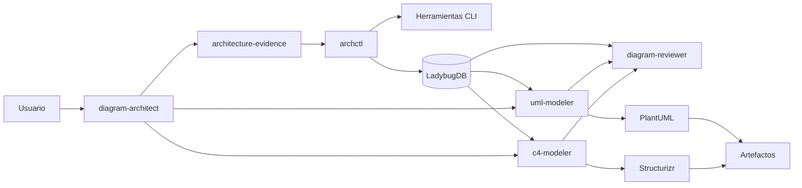

# OpenCode Architecture Diagrammer

**Estado:** propuesta revisada  
**Versión documental:** 2.1  
**Fecha:** 29 de julio de 2026  
**Documento rector:** `Skills-para-agentes-IA-v2.md`

## Propósito

Crear una configuración dedicada de OpenCode para investigar repositorios y generar diagramas C4 y UML mediante agentes y skills especializados.

La arquitectura se mantiene deliberadamente pequeña:

1. **OpenCode es el entorno de interacción y orquestación.**
2. Un agente director coordina subagentes especializados.
3. Las skills contienen los procedimientos de descubrimiento, modelado, generación y revisión.
4. Se reutilizan skills y herramientas existentes mediante wrappers y adaptadores.
5. `archctl` es una CLI sidecar:
   - resuelve proyecto y worktree;
   - ejecuta herramientas de extracción;
   - normaliza evidencias;
   - persiste y consulta el grafo;
   - mantiene snapshots, modelos y artefactos;
   - permite recuperar y actualizar diagramas.
6. **LadybugDB** es la persistencia embebida del grafo, con una base `architecture.lbdb` por proyecto.
7. Los datos se guardan bajo XDG, fuera del repositorio analizado.
8. C4, casos de uso, clases y secuencias son proyecciones sobre un grafo canónico común.

## Arquitectura resumida

## Documentos

### Visión y planificación

- [`Skills-para-agentes-IA-v2.md`](Skills-para-agentes-IA-v2.md)
- [`DATA-MODEL-LADYBUGDB.md`](DATA-MODEL-LADYBUGDB.md)
- [`ROADMAP.md`](ROADMAP.md)

### ADR

- [`ADR-000`](adr/ADR-000-reinicio-de-alcance.md): reinicio de alcance.
- [`ADR-001`](adr/ADR-001-opencode-first-archctl-sidecar.md): OpenCode primero y `archctl` como sidecar.
- [`ADR-002`](adr/ADR-002-topologia-de-agentes.md): topología mínima de agentes.
- [`ADR-003`](adr/ADR-003-reutilizacion-y-adaptacion-de-skills.md): reutilización de skills.
- [`ADR-004`](adr/ADR-004-persistencia-externa-xdg.md): persistencia externa por proyecto y worktree.
- [`ADR-005`](adr/ADR-005-ladybugdb-grafo-canonico-y-evidencias.md): LadybugDB como grafo canónico.
- [`ADR-006`](adr/ADR-006-adaptadores-de-herramientas-cli.md): adaptadores de herramientas existentes.
- [`ADR-007`](adr/ADR-007-modelos-y-renderizadores-de-diagramas.md): diagramas como proyecciones.
- [`ADR-008`](adr/ADR-008-recuperacion-versionado-y-evolucion.md): snapshots, recuperación y evolución.
- [`ADR-009`](adr/ADR-009-relaciones-semanticas-reificadas.md): relaciones reificadas e índice de aristas.
- [`ADR-010`](adr/ADR-010-concurrencia-ladybugdb.md): concurrencia y escritor único.

### Esquema

- [`schema/README.md`](schema/README.md)
- [`schema/001_initial_schema.cypher`](schema/001_initial_schema.cypher)
- [`schema/metamodel-core.json`](schema/metamodel-core.json)

### View specs (delta specs from SDD cycles)

Indexed 2026-08-07 (M47). Each spec documents a view's element kinds, edge
predicates, and projection shape mapping for Mermaid + PlantUML.

- [`specs/diagram-projection-bundle.md`](specs/diagram-projection-bundle.md) — bundle contract (manifest + projection + evidence + styles)
- [`specs/use-case-view.md`](specs/use-case-view.md) — `usecase:*` view (uml.actor, uml.use_case, participates_in)
- [`specs/state-and-c4-views.md`](specs/state-and-c4-views.md) — `state:*` and `c4-*:*` views
- [`specs/sequence-view-labels.md`](specs/sequence-view-labels.md) — `sequence:*` view with edge label support
- [`specs/plantuml-render.md`](specs/plantuml-render.md) — PlantUML render via user-installed backend (M40)
- [`specs/source-evaluation-types.md`](specs/source-evaluation-types.md) — source evaluation types
- [`specs/filesystem-port.md`](specs/filesystem-port.md) — filesystem port trait
- [`specs/code-class-diagram/`](specs/code-class-diagram/) — code → class diagram pipeline
- [`specs/bench-harness.md`](specs/bench-harness.md) — benchmark harness
- [`specs/bench-methodology.md`](specs/bench-methodology.md) — benchmark methodology
- [`specs/e2e-installation.md`](specs/e2e-installation.md) — E2E installation suite
- [`specs/e2e-render.md`](specs/e2e-render.md) — E2E render suite
- [`specs/e2e-sandbox.md`](specs/e2e-sandbox.md) — E2E sandbox suite

### Schemas (JSON Schema 2020-12)

Public contracts for downstream tooling. Source of truth lives in
`schemas/` at the workspace root.

- [`schemas/diagram-projection.schema.json`](../schemas/diagram-projection.schema.json) — bundle envelope (4 required keys)
- [`schemas/changeset.schema.json`](../schemas/changeset.schema.json) — apply changeset format
- [`schemas/call-graph-report.schema.json`](../schemas/call-graph-report.schema.json)
- [`schemas/class-diagram-report.schema.json`](../schemas/class-diagram-report.schema.json)
- [`schemas/sequence-report.schema.json`](../schemas/sequence-report.schema.json)
- [`schemas/state-machine-report.schema.json`](../schemas/state-machine-report.schema.json)
- [`schemas/discover-report.schema.json`](../schemas/discover-report.schema.json)

## Decisiones explícitamente descartadas

- Convertir `archctl` en un portal o plataforma de reporting.
- Hacer que `archctl` orqueste modelos LLM.
- Crear parsers, indexadores o call graphs multilenguaje propios.
- Mantener el conocimiento arquitectónico únicamente en conversaciones.
- Introducir PostgreSQL, Neo4j, Kafka o servicios obligatorios.
- Escribir `.architecture/`, `.opencode/`, índices o renders dentro del repositorio por defecto.
- Mantener C4, UML y secuencias en bases o modelos inconexos.
- Tratar Mermaid, PlantUML, Structurizr o draw.io como fuente canónica.
- Duplicar o modificar directamente skills upstream.
- Crear un enjambre grande de agentes.
