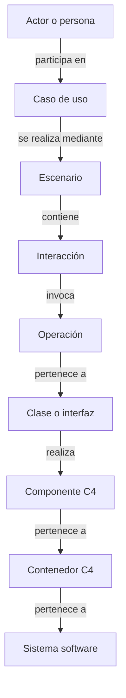
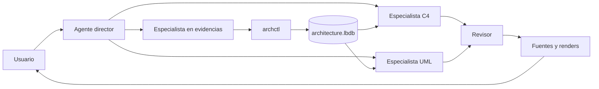

# Skills para agentes de IA especializados en C4 y UML

**Estado:** propuesta base revisada  
**Versión:** 2.1  
**Fecha:** 29 de julio de 2026  
**Ámbito:** OpenCode, Agent Skills, subagentes especializados, `archctl` y LadybugDB

---

## 1. Propósito

Crear una configuración dedicada de OpenCode que investigue una base de código y genere diagramas arquitectónicos y de diseño útiles, trazables, recuperables y actualizables.

Resultados principales:

### C4

- System Landscape.
- System Context.
- Container.
- Component.
- Dynamic.
- Deployment.

### UML

- Casos de uso.
- Clases.
- Secuencia.
- Actividad.
- Estado.
- Componentes.
- Despliegue.

### Vistas auxiliares

- Dependencias de módulos.
- Rutas y jerarquías de llamadas.
- Flujos de eventos.
- Relaciones entre servicios y datos.
- Bounded contexts y agregados.
- Diagramas editables para revisión humana.

---

## 2. Principio rector

```text
OpenCode y sus agentes entienden y modelan.
Las skills enseñan procedimientos especializados.
Las herramientas existentes extraen hechos.
archctl normaliza, persiste, consulta y proyecta.
LadybugDB conserva el grafo canónico.
Los renderizadores producen artefactos.
```

`archctl` no sustituye a OpenCode, no contiene prompts de arquitectura y no decide qué significa el sistema.

---

## 3. Grafo canónico

C4, casos de uso, clases y secuencias se conectan mediante identidades compartidas:



Cada diagrama es una vista de este conocimiento, no una copia aislada.

El detalle completo se define en [`DATA-MODEL-LADYBUGDB.md`](DATA-MODEL-LADYBUGDB.md).

---

## 4. Experiencia de uso

```text
/diagram c4 context
/diagram c4 container
/diagram c4 component payments
/diagram c4 dynamic "crear pedido"
/diagram use-cases checkout
/diagram class order-domain
/diagram sequence "crear pedido"
/diagram calls src/orders/create.rs::create_order
/diagram explain c4:container:payment-service
/diagram evidence rel:orders-payment
/diagram update
```

Flujo:



---

## 5. Arquitectura mínima de agentes

### 5.1 `diagram-architect`

Agente primario.

Responsabilidades:

- comprender la pregunta;
- seleccionar el tipo de diagrama;
- decidir propósito, audiencia, alcance y nivel;
- recuperar conocimiento previo;
- delegar investigación y modelado;
- combinar vistas cuando aporte claridad;
- presentar evidencias e incertidumbres;
- solicitar revisión antes de aceptar el resultado.

No debe:

- recorrer manualmente todo el repositorio;
- inventar relaciones a partir de nombres;
- generar un diagrama sin pregunta concreta;
- escribir directamente en `architecture.lbdb`;
- tratar el render como fuente de verdad.

### 5.2 `architecture-evidence`

Responsabilidades:

- explorar el repositorio;
- consultar `archctl`;
- solicitar capacidades de extracción;
- comprobar código, configuración, contratos, tests e infraestructura;
- registrar elementos, relaciones y evidencias;
- distinguir `observed`, `derived`, `inferred` y `confirmed`.

Puede reutilizar el subagente `explore` de OpenCode para búsquedas acotadas.

### 5.3 `c4-modeler`

Responsabilidades:

- aplicar niveles C4 correctamente;
- reutilizar identidades del grafo;
- crear Context, Container, Component, Dynamic y Deployment;
- producir Structurizr DSL como salida preferente;
- almacenar la especificación de vista y los artefactos mediante `archctl`.

### 5.4 `uml-modeler`

Responsabilidades:

- seleccionar el diagrama UML adecuado;
- producir casos de uso, clases, secuencias, actividad y estado;
- evitar volcados exhaustivos sin propósito;
- construir secuencias a partir de escenarios y rutas de llamadas;
- producir PlantUML como salida preferente.

Se dividirá en modelador estructural y de comportamiento solo si las evaluaciones lo justifican.

### 5.5 `diagram-reviewer`

Responsabilidades:

- verificar sintaxis y renderizado;
- comprobar fidelidad con el grafo y las evidencias;
- detectar mezcla de abstracciones;
- revisar legibilidad, saturación, cruces y etiquetas;
- rechazar elementos o relaciones no sustentados;
- marcar el diagrama como `accepted`, `needs-fix` o `needs-evidence`.

---

## 6. Skills upstream reutilizadas

### `c4-codebase-architecture`

Fuente:

- `lmammino/c4-codebase-architecture-skill`

Uso:

- reverse engineering basado en evidencias;
- Context, Container y Component;
- wrapper para consumir y producir IDs de `archctl`.

### `c4-architecture`

Fuente:

- `bitsmuggler/c4-skill`

Uso:

- modelo Structurizr;
- Landscape, Context, Container, Component, Dynamic y Deployment;
- salidas redirigidas a XDG.

### `c4-model`

Fuente:

- `cheriftj/c4-model-skill`

Uso:

- workflow de diseño, recuperación, revisión y actualización;
- checkpoints adaptados a ejecuciones persistidas.

### `plantuml-skill`

Fuente:

- `Agents365-ai/plantuml-skill`

Uso:

- casos de uso, clases, secuencia, actividad, estado, componentes y despliegue;
- validación y render local.

### `mermaid-skill`

Uso:

- Markdown y previews pequeños;
- no es el modelo canónico C4.

### `drawio-skill`

Uso:

- entrega editable;
- no modifica automáticamente el grafo canónico.

---

## 7. Wrappers propias

```text
skills/
├── architecture-discovery/
├── c4-from-graph/
├── use-cases-from-graph/
├── class-view-from-graph/
├── sequence-from-scenario/
└── diagram-review/
```

### `architecture-discovery`

- reutiliza el procedimiento upstream;
- solicita inventario y extracciones a `archctl`;
- registra evidencias;
- devuelve IDs canónicos.

### `c4-from-graph`

- recibe una raíz C4, propósito y nivel;
- consulta el subgrafo;
- produce una especificación de vista;
- genera Structurizr;
- no crea una identidad nueva si ya existe.

### `use-cases-from-graph`

- identifica actores y objetivos;
- diferencia candidatos inferidos y confirmados;
- relaciona casos de uso con escenarios.

### `class-view-from-graph`

- recibe un módulo, agregado, componente o colaboración;
- selecciona únicamente clases, interfaces, atributos y operaciones relevantes;
- genera PlantUML.

### `sequence-from-scenario`

- parte de un caso de uso, escenario, endpoint, test o símbolo;
- solicita rutas de llamadas;
- agrupa llamadas técnicas en participantes significativos;
- proyecta la secuencia a nivel sistema, contenedor, componente, clase u operación.

### `diagram-review`

- valida fuente y render;
- comprueba la especificación de vista;
- compara miembros y relaciones con el grafo;
- persiste el resultado de la revisión.

---

## 8. Integración de skills en OpenCode

Las skills se instalan globalmente o en un perfil dedicado:

```text
$XDG_CONFIG_HOME/opencode-architecture/
├── opencode.jsonc
├── agents/
├── commands/
├── tools/
├── plugins/
└── skills/
    ├── upstream/
    └── wrappers/
```

Inicio:

```bash
export OPENCODE_CONFIG_DIR="${XDG_CONFIG_HOME:-$HOME/.config}/opencode-architecture"
opencode
```

Se mantiene un `skills.lock.yaml` externo con repositorio, versión, licencia, hash y wrapper.

Las copies upstream son inmutables. Los cambios viven en wrappers o parches reproducibles.

---

## 9. `archctl`: alcance exacto

### Responsabilidades

- resolver repositorio, clon y worktree;
- crear la estructura XDG;
- abrir y migrar `architecture.lbdb`;
- iniciar, recuperar y cerrar ejecuciones;
- invocar adaptadores CLI;
- normalizar resultados;
- registrar metatipos, elementos, predicados, relaciones y evidencias;
- materializar el índice de aristas;
- consultar vecinos, caminos y subgrafos;
- crear snapshots y overlays;
- persistir especificaciones de vistas;
- guardar modelos, fuentes y renders;
- invalidar evidencias y diagramas afectados;
- devolver JSON estable a OpenCode.

### No responsabilidades

- decidir qué diagrama necesita el usuario;
- interpretar arquitectura sin intervención de las skills;
- gestionar proveedores LLM;
- ser una aplicación web;
- reimplementar parsers o indexadores;
- convertir LadybugDB en una base accesible directamente por los agentes;
- ser un MCP o daemon obligatorio en el MVP.

### Comandos iniciales

```bash
archctl project resolve --cwd .
archctl project status
archctl doctor

archctl db init
archctl db migrate
archctl db export
archctl db import
archctl db verify

archctl run start --kind diagram
archctl run checkpoint
archctl run finish
archctl run resume <run-id>

archctl scan inventory
archctl scan ast --profile <profile>
archctl scan dependencies
archctl scan call-path --from <symbol> --to <symbol>

archctl graph element get <id>
archctl graph relation get <id>
archctl graph neighbours <id>
archctl graph path --from <id> --to <id>
archctl graph evidence <id>
archctl graph repair-index

archctl snapshot create --commit HEAD
archctl snapshot diff <a> <b>

archctl scenario interactions <id>
archctl scenario project <id> --level component

archctl diagram put specification.json
archctl diagram materialize <id>
archctl diagram render <id>
archctl diagram validate <id>
```

---

## 10. Persistencia con LadybugDB

Cada proyecto mantiene:

```text
$XDG_DATA_HOME/archctl/projects/<host>/<owner>/<repo>--<id>/
├── architecture.lbdb
├── project.json
├── models/
├── diagrams/
├── rendered/
├── exports/
└── worktrees/
```

LadybugDB almacena:

- metatipos y predicados;
- elementos canónicos;
- relaciones canónicas;
- aristas derivadas;
- evidencias;
- ficheros y ejecuciones de herramientas;
- snapshots y versiones;
- diagramas y miembros de vista;
- referencias a artefactos.

Los ficheros grandes permanecen fuera de la base y se referencian mediante ruta y hash.

### Concurrencia

En el MVP, cada invocación de `archctl` toma un bloqueo por proyecto antes de abrir la base en escritura.

Una evolución opcional podrá introducir `archctld`, con un único objeto de base y múltiples conexiones, pero no es requisito inicial.

---

## 11. Modelo extensible

El esquema físico utiliza tablas genéricas tipadas:

```text
MetaType
Predicate
Element
ElementVersion
SemanticRelation
RelationVersion
Evidence
Snapshot
Artifact
```

Los dominios se extienden registrando tipos:

```text
c4.container
uml.class
behavior.scenario
ddd.aggregate
cloud.azure_resource
jenkins.pipeline
```

Y predicados:

```text
core.contains
core.depends_on
uml.implements
usecase.includes
behavior.invokes
ddd.publishes
```

`archctl` valida las restricciones semánticas declaradas en el catálogo.

---

## 12. Herramientas de extracción

### Núcleo

- Git.
- ripgrep.
- `ast-grep`.
- herramientas nativas del build.
- Structurizr CLI.
- PlantUML.
- Mermaid CLI cuando sea necesario.

### Opcionales

- LSP de OpenCode.
- SCIP.
- Universal Ctags.
- dependency-cruiser.
- `jdeps`.
- Semgrep.
- Joern.
- Terraform, Helm y kubectl.
- Syft.

### Regla

```text
Pregunta sencilla
  → Git + ripgrep + ast-grep + build metadata

Referencias precisas
  → LSP, SCIP o herramienta nativa

Ruta compleja
  → Joern, Semgrep u otra herramienta profunda

Infraestructura
  → CLI oficial del ecosistema
```

Los agentes solicitan capacidades; `archctl` selecciona el adaptador.

---

## 13. Diagramas como consultas

Cada diagrama declara:

```text
propósito
audiencia
raíz
alcance
nivel de proyección
selectores
relaciones permitidas
reglas de agrupación
evidencias
```

### C4

- Structurizr DSL como modelo de salida preferente.
- Las vistas seleccionan elementos C4 del grafo.
- Dynamic utiliza escenarios existentes.

### Casos de uso

- Actores, objetivos, includes, extends y escenarios.
- Un endpoint genera como máximo un candidato inferido, no un caso de uso confirmado.

### Clases

- Alcance por agregado, módulo, componente o colaboración.
- No se vuelca el repositorio completo.

### Secuencia

- `Interaction` es un elemento ordenado del escenario.
- El mismo escenario puede proyectarse a sistema, contenedor, componente, clase u operación.

### Mermaid y draw.io

Son formatos derivados.

---

## 14. Evidencias

Toda afirmación importante puede apuntar a evidencias:

```json
{
  "id": "ev:astgrep:abc123:001",
  "classification": "observed",
  "claim": "CreateOrderController invoca CreateOrderHandler.handle",
  "source": {
    "path": "src/orders/controller.rs",
    "start_line": 42,
    "end_line": 48,
    "commit": "abc123"
  },
  "extractor": {
    "name": "ast-grep",
    "rule": "rust-handler-invocation"
  },
  "confidence": 0.99
}
```

Clasificaciones:

```text
observed
derived
inferred
confirmed
contradicted
```

---

## 15. Actualización incremental

Cuando cambia un fichero:

1. Se localizan evidencias extraídas de él.
2. Se invalidan las versiones sustentadas únicamente por esas evidencias.
3. Se ejecutan solo los adaptadores afectados.
4. Se recalculan relaciones.
5. Se reconstruye el índice materializado necesario.
6. Los diagramas dependientes se marcan `stale`.
7. El agente decide qué vista regenerar.

---

## 16. Recuperación

Cada ejecución conserva:

- petición;
- proyecto, worktree y commit;
- etapas;
- agentes y skills;
- herramientas y versiones;
- snapshot de entrada y salida;
- artefactos;
- errores y checkpoint.

El historial conversacional es útil, pero no es la memoria canónica.

---

## 17. Criterios de éxito del MVP

Desde cualquier repositorio y sin escribir en él, OpenCode podrá:

1. crear Context y Container coherentes;
2. generar un caso de uso acotado;
3. generar una vista de clases de un módulo o dominio;
4. generar una secuencia desde un escenario o entrypoint;
5. proyectar una secuencia a varios niveles;
6. justificar elementos y relaciones con evidencias;
7. guardar y recuperar el grafo en LadybugDB;
8. actualizar únicamente el alcance afectado;
9. reutilizar skills upstream sin forks permanentes;
10. rechazar un diagrama renderizable pero no sustentado.
