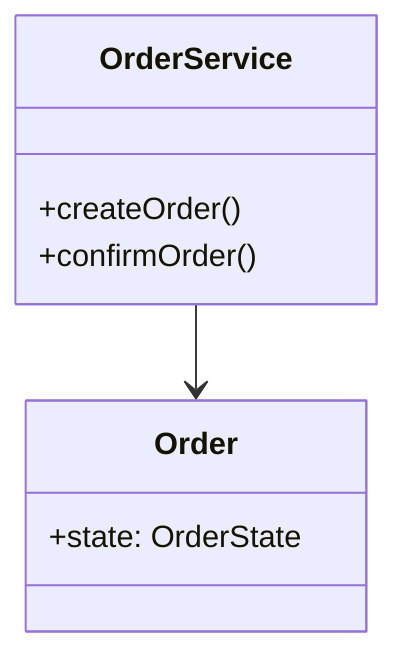

# ADR-028 — Diagram Project: ProjectSelector vs C4Kind + Multi-Format DSL Projection

> **Ciclo:** `b1-source-evaluation-types`
> **Estado:** Aceptado (propuesto)
> **Fecha:** 2026-08-04
> **Complementa:** [ADR-007](ADR-007-modelos-y-renderizadores-de-diagramas.md) + [ADR-013](ADR-013-viewer-ortogonal.md)

## Problema

El sistema actual tiene:
- `diagram export` → viewer-bundle JSON (para archview, C4-only, contrato ADR-013)
- `render <source>` → SVG (solo Structurizr funciona; PlantUML/Mermaid deferred por `libgraphviz-dev`)

**No existe** un comando que tome el grafo y produzca fuente **PlantUML/Mermaid/Structurizr editable**. El agente no puede generar diagramas que el usuario edite manualmente. Las skills referencian `diagram materialize` y `diagram project` como comandos existentes — no lo son.

## Decisiones

### D1 — `diagram project` usa `ProjectSelector` separado de `C4Kind`

**Elección:** Se crea `diagram/project_selector.rs` con un `ViewKind` enum que soporta C4 + UML + behavior views, completamente independiente de `C4Kind` usado por `diagram export`.

```rust
pub enum ViewKind {
    // C4 views
    C4Context,
    C4Container,
    C4Component,
    // UML views
    Class,
    Sequence,
    State,
    UseCase,
}

pub struct ProjectSelector {
    pub view_kind: ViewKind,
    pub scope: ScopeFilter,  // reutiliza ScopeFilter de selector.rs
}
```

**`selector.rs` (export) NO se modifica.** `C4Kind` y `ViewSelector` de export son internos a `diagram/export.rs`. `diagram project` tiene su propio parser y su propio selector.

**Rationale:** `diagram export` tiene contrato ADR-013: viewer-bundle es C4-only. Extender `C4Kind` para incluir `class`/`sequence`/`state`/`usecase` diluye ese contrato y confunde la audiencia (archview no renderiza UML class diagrams). El nuevo selector sirve a agentes que necesitan proyectar todos los tipos UML.

**Alternativas rechazadas:**
- Extender `C4Kind` para incluir todos los tipos — rechazado: rompe el contrato ADR-013 y la separación de concerns entre viewer y editor.
- Unificar selector con flag `--type c4|uml|behavior` — rechazado: la gramática `<kind>:<scope>` de export ya existe y los dos usos comparten `ScopeFilter`. Pero kinds no son compartidos.

### D2 — View kind → category mapping

**Elección:** Cada `ViewKind` mapea a un category del grafo:

| ViewKind | Category | Análogo existente |
|----------|----------|-------------------|
| C4Context, C4Container, C4Component | `c4` | `query_elements(store, "c4", scope)` |
| Class | `uml` | `query_elements(store, "uml", scope)` filtrando por `kind_id: uml.class` |
| Sequence | `behavior` | `query_elements(store, "behavior", scope)` |
| State | `uml` | `query_elements(store, "uml", scope)` filtrando por `kind_id: uml.state` |
| UseCase | `uml` | `query_elements(store, "uml", scope)` filtrando por `kind_id: uml.use_case` |

**Rationale:** La misma query `query_elements` sirve para todos — es category-agnostic en diseño. Los projectors usan el ViewKind para saber qué attributes/properties extraer y cómo proyectarlos a DSL.

### D3 — Emitters para 3 formatos de salida

**Elección:** `diagram/project/` con 3 projectors:

```
diagram/project/
  mod.rs              — trait Projector, factory Projector::for_format()
  plantuml.rs         — PlantUMLEmitter
  mermaid.rs          — MermaidEmitter
  structurizr.rs      — StructurizrEmitter
```

**Sintaxis por formato y view kind:**

**PlantUML (`.puml`):**
```
@startuml
class OrderService {
  +createOrder()
  +confirmOrder()
}
class Order {
  +state: OrderState
}
OrderService --> Order
@enduml
```

**Mermaid (`.mmd`):**


**Structurizr DSL (`.dsl`):**
```
workspace {
  model {
    service = "OrderService"
    component = "Order"
  }
  views {
    component *system {
      autoLayout
    }
  }
}
```

**Para State view (cualquier formato):** el proyector emite los estados como nodos y las transiciones como flechas etiquetadas con el trigger.

**Rationale:** PlantUML y Mermaid son los dos formatos más usados en documentación de arquitectura. Structurizr DSL es el formato nativo de `render`. Los tres son editables por humanos — el agente puede generar la fuente y el usuario la refina.

### D4 — DSL editable, no SVG directo

**Elección:** `diagram project` escribe **fuente DSL** (`.puml`/`.mmd`/`.dsl`) a `--output`. No encadena `render` automáticamente.

**Rationale:**
- PlantUML y Mermaid están deferred por `libgraphviz-dev` — encadenar render fallaría silenciosamente
- El usuario puede editar el DSL sin depender del render
- El agente puede entregar el archivo fuente como artefacto final si render falla
- Separación de concerns: `project` = proyección, `render` = renderizado

**Alternativas rechazadas:**
- `diagram project --render` encadenado — rechazado: acopla al vendor de graphviz, falla silenciosamente si falta la dependencia
- Producir SVG directamente — rechazado: SVG no es editable por humanos

### D5 — Grammar de selector: `<kind>:<scope>`

**Elección:** `diagram project` usa la misma gramática que `diagram export`:

```
c4-container:*        — todos los containers C4
c4-container:orders    — solo el container "orders"
class:*                — todas las clases UML
class:OrderService     — solo la clase "OrderService"
state:*                — todos los estados
state:OrderState       — solo la máquina de estados "OrderState"
```

**Scope `*` significa "todos"** (no se filtra por `canonical_key`). Scope específico usa `validate_identifier()` para prevenir inyección Cypher.

### D6 — Query semantics: category-agnostic con filtro de tipo

**Elección:** `diagram project` usa `query_elements` y `query_semantic_edges` de `diagram/queries.rs` (existentes, category-agnostic).

```rust
// diagram/project/class_diagram.rs
pub fn project(
    store: &dyn GraphStore,
    selector: &ProjectSelector,
) -> Result<String> {
    // 1. Determina category desde ViewKind
    let category = selector.view_kind.category(); // "uml", "c4", "behavior"
    // 2. Determina kind_id filter desde ViewKind
    let kind_filter = selector.view_kind.kind_id(); // Some("uml.class") o None
    // 3. query_elements(store, category, scope_ident)
    let elements = query_elements(store, category, scope_ident)?;
    // 4. query_semantic_edges(store, category)
    let edges = query_semantic_edges(store, category)?;
    // 5. Filtrar elements por kind_id si aplica
    // 6. Proyectar a DSL según format
}
```

**Rationale:** `query_elements` y `query_semantic_edges` ya son read-only y category-agnostic. Los projectors solo añaden el mapeo element → sintaxis DSL y el filtrado por ViewKind.

---

## Relación con `diagram export` (viewer-bundle)

| Aspecto | `diagram export` | `diagram project` |
|---------|-----------------|-------------------|
| Output | viewer-bundle JSON (5 archivos) | fuente DSL editable (`.puml`/`.mmd`/`.dsl`) |
| Audience | archview (visor) | usuario/agente (edición) |
| Kinds | Solo C4 | C4 + UML class + sequence + state + use case |
| Selector | `C4Kind` (interno) | `ViewKind` / `ProjectSelector` |
| Formato | Fijo | PlantUML / Mermaid / Structurizr |
| Requiere render | Sí (archview) | No (el usuario/editable) |

---

## Consequences

### Positivos
- Agente puede generar diagramas editables en PlantUML/Mermaid/Structurizr
- Separación clara: `export` = viewer-bundle, `project` = fuente editable
- Reutiliza queries existentes sin cambios
- Formato de salida determinista (misma query → misma fuente DSL)

### Negativos
- Dos selectores (`C4Kind` vs `ViewKind`) pueden confundir si no se documenta la diferencia
- PlantUML/Mermaid no se renderizan localmente sin `libgraphviz-dev`

### Riesgos residuales
- **Selector grammar ambigua**: `class:*` podría interpretarse como C4 class (no existe) — mitigado: `class` es unambiguously UML en el contexto de `diagram project`
- **Empty graph output**: si no hay elementos para el selector, se produce DSL vacío — mitigado: el projector emite una nota `"" -- No elements found for selector`

## Prohibiciones

- `diagram project` NO reemplaza `diagram export` — son comandos distintos con audiencias distintas
- `diagram project` NO produce SVG directamente — siempre fuente DSL editable
- Los projectors NO escriben al grafo — son read-only desde `query_elements`/`query_semantic_edges`
