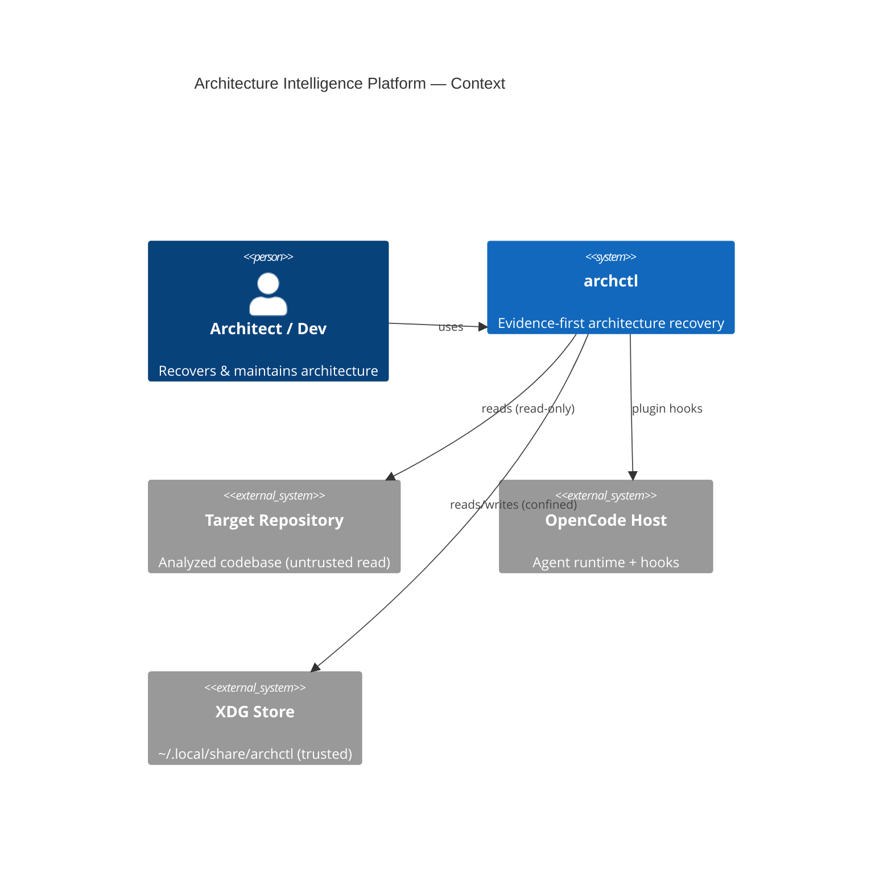
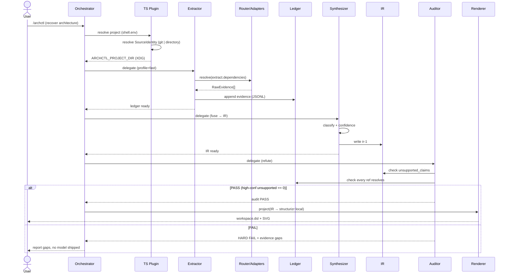

# Design: Architecture Intelligence Platform — Plugin-First / No-Rust-First

> **Phase 1.4 design · Context C0 (greenfield) · Entropy method: heuristic (Protocol C) · No product code written here**
> Inputs: `explore-report.md`, `proposal.md`, `Skills-para-agentes-IA.md` (traceability), live OpenCode schema `https://opencode.ai/config.json` (authority on exact shapes).
> All ADRs referenced here are **Proposed** (see `docs/adr/`).

---

## Technical Approach

**Strategy:** a reversible, evidence-first pipeline that recovers a codebase's architecture as *traceable evidence*, fuses it into a *neutral IR*, and projects it to C4/UML — with zero Rust, zero Git pollution, and a falsifiable validation gate before any platform investment.

The design maps directly to the proposal's three levels and five capabilities:

| Proposal element | Design realization |
|---|---|
| Phase 0 skill-only baseline | 1 `SKILL.md` + 1–2 wrapped skills; no plugin, no IR |
| Phase 1–2 plugin-first MVP | 4 agent roles + thin TS plugin + Evidence/IR v1 + capability router + local renderers |
| Phase 3 Rust (conditional) | Not designed in detail; the *seam* (uniform adapter contract) is what keeps it open |

**Invariants enforced by design:** (1) IR is the single source of truth; diagrams are projections. (2) No element of `confidence ≥ 0.9` may exist without an evidence reference. (3) Writes are confined to XDG by a plugin guard. (4) Renderers are deterministic tooling, never agents.

---

## 1. Minimal Deployable Topology

### Skill-only baseline (Phase 0) — the fallback that survives any hypothesis failure

```
OpenCode native agent
   ↓ loads on demand
SKILL.md  (evidence discipline + "Structurizr is the canonical projection")
   ↓ invokes
existing skills (lmammino c4, plantuml) + CLIs via bash
   ↓ produces
Structurizr/PlantUML diagrams  (no persistent IR, no ledger)
```
Irreversibility: **very low**. Delete skills to remove. Residual value: disciplined manual diagramming.

### Plugin-first MVP (Phase 1–2) — 4 roles, rendering is NOT an agent

| Role | OpenCode mode | Responsibility | Write scope |
|---|---|---|---|
| **Orchestrator** (`archctl-orchestrator`) | `primary` | Drives discovery→evidence→synthesis→audit; delegates to subagents; gates on quality invariants | XDG only (via guard) |
| **Extractor / Cartographer** (`archctl-extractor`) | `subagent` | Runs read-only CLIs through the capability router; collects `RawEvidence` | None (read-only CLIs) |
| **Synthesizer / Modeler** (`archctl-synthesizer`) | `subagent` | Fuses evidence → IR v1; assigns `classification` + `confidence` | XDG ledger + IR |
| **Auditor / Falsifier** (`archctl-auditor`) | `subagent` | Refutes claims; enforces `unsupported_claims_high_confidence == 0`; **cannot edit IR, only flag** | XDG audit report |

**Rendering is deterministic tooling**, not an agent: `project(IR → format)` is a code function + local CLI (Structurizr `local`, PlantUML jar). An LLM never decides where a box goes. This is the key cut from the 9-agent fantasy.

`subagent_depth: 2` (orchestrator → specialist → bounded sub-task). Confirmed valid against the live schema.

---

## 2. Component Boundaries, Dependency Direction, Seams

```
                          ┌─────────────────────────────────────────────┐
  Target repo (READ)  ───▶│  Extractor ──▶ Capability Router ──▶ Adapters│
                          └──────────┬──────────────────────────────────┘
                                     ▼  RawEvidence[]
                          ┌──────────────────────┐
                          │  Evidence Ledger (JSONL) │  ◀── append-only
                          └──────────┬───────────┘
                                     ▼
                          ┌──────────────────────┐        ┌────────────┐
                          │  Synthesizer ──▶ IR v1 (JSON) │◀─ write ──│ (audit cannot
                          └──────────┬───────────┘        │           │  mutate IR)
                                     │ read               │           │
                          ┌──────────▼───────────┐        │           │
                          │  Auditor ─────────────│───────▶│ (report)  │
                          └──────────┬───────────┘        └────────────┘
                                     ▼ PASS
                          ┌──────────────────────┐
                          │  Projection ──▶ Renderers (deterministic)  │
                          │   IR→DSL (code)   Structurizr local / PlantUML│
                          └──────────────────────┘
                                     ▼
                                   XDG export
```

**Dependency direction is strictly acyclic:** evidence → ledger → IR → projection. **No back-edges from renderers to IR.** The auditor reads IR+ledger but writes only a report; if it finds gaps it *escalates to the orchestrator*, which may re-run extraction (a new ledger append), never a silent IR mutation.

**Seams (the places that can change independently):**

| Seam | What crosses it | Coupling mitigation |
|---|---|---|
| Capability adapter | abstract capability → concrete CLI | Uniform `Adapter` contract (§5); OCP-perfect |
| Plugin ↔ OpenCode API | hook semantics | Version-pin + CI schema-contract test (ADR-0007) |
| IR schema hub | every consumer reads IR | `schemaVersion` + minimal fields + extension policy (§3) |
| Projection | IR → renderer DSL | Pure function per renderer; renderer-swappable |

**Idempotency:** same identity anchor (Git commit *or* content snapshot) + same adapter set ⇒ same IR. Element IDs are content-derived (`el_` + short hash of `kind:name:primary-evidence`), so re-runs converge. Target: Jaccard ≥ 0.95 across two runs on the same anchor. Works in both Git and directory modes.

**Checkpoints:** after each stage (extract → synthesize → audit) the pipeline persists a stage marker to XDG state. MVP persists ledger + IR after synthesis; full resume-from-marker is Phase 3. Resume never re-derives a completed stage.

**Versioning / migrations:** every artifact carries `schemaVersion`. A migration registry maps `evidence-N → evidence-(N+1)`. An unknown version ⇒ loud `SchemaIncompatible` failure (never guess).

**Error model:**

| Condition | Result | Fatal? |
|---|---|---|
| Adapter CLI missing / fails | `CapabilityUnavailable` → degraded extraction, evidence marked partial | No |
| Element `confidence ≥ 0.9` with no evidence ref | `QualityGateViolation` (HARD FAIL) | **Yes** — pipeline aborts |
| `schemaVersion` unknown | `SchemaIncompatible` | Yes (loud) |
| Renderer fails to produce output | `RenderError` | Yes (quality gate requires render-success = 100%) |

---

## 3. Minimal Evidence v1 and IR v1 Schemas

> **No speculative fields.** Extension *points* exist (a freeform `meta` bag + `schemaVersion` + documented policy), but no field ships without a current consumer. Temporal `validFrom/validTo` is **deferred to Phase 4** and is NOT in v1.

### Evidence record v1 (JSONL, one record per observation)

```json
{
  "schemaVersion": "evidence-1",
  "evidenceId": "ev_01H.../",
  "kind": "declared",
  "source": {
    "path": "src/auth/mod.rs",
    "lines": [12, 45],
    "revision": { "type": "git-commit", "value": "a1b2c3d" },
    "observedAt": "2026-07-29T10:00:00Z"
  },
  "extractor": "ast-grep:outline",
  "observed": {
    "type": "module",
    "name": "auth",
    "detail": "pub mod auth;"
  },
  "confidence": 0.85,
  "classification": "fact",
  "capturedAt": "2026-07-29T10:00:00Z"
}
```
- `kind`: `declared` (docs/IaC/ADR) or `static` (code/imports) in MVP. `observed` (runtime) is a **deferred enum value**, not present until Phase 5 — but the axis is designed so adding it is additive, not breaking.
- `revision` is a **discriminated union** pinning what the evidence was observed against:
  - `{ "type": "git-commit", "value": "<sha>" }` when Git is available (richer, history-sharable);
  - `{ "type": "content-hash", "value": "blake3:<snippet-range>" }` when there is no Git — then `observedAt` is the snapshot anchor (local-only stability).
- `observedAt` is the capture/snapshot timestamp; required for `content-hash`, present for `git-commit`.
- `revision.value` (content-hash mode) covers the *snippet range*, not the whole file (`store-source-snippets: false` default → source text is never persisted).

### Architecture IR v1 (JSON)

```json
{
  "schemaVersion": "ir-1",
  "projectId": "blake3:...",
  "generatedAt": "2026-07-29T10:05:00Z",
  "elements": [
    {
      "id": "el_8f2a",
      "kind": "container",
      "name": "auth-service",
      "tags": ["service"],                // non-canonical distinction; NOT a top-level kind
      "confidence": 0.85,
      "classification": "fact",
      "evidence": ["ev_01H...", "ev_01K..."]
    }
  ],
  "relationships": [
    {
      "id": "rel_3c1",
      "from": "el_8f2a",
      "to": "el_9d4b",
      "kind": "depends-on",
      "confidence": 0.7,
      "classification": "inference",
      "evidence": ["ev_01Z..."]
    }
  ]
}
```
- `kind` vocab (elements): the renderer-neutral, C4-compatible closed set is `person | softwareSystem | container | component | codeElement` — C4's five levels, nothing else competes at the top level. **Non-canonical distinctions (`module`, `service`, …) are NOT top-level kinds**: they live in `tags` (and may surface via `classification`). Why one axis: it keeps `container` vs `module` from becoming ambiguous competing kinds and keeps every projection (Structurizr/PlantUML/Mermaid) lossless — projections consume the C4 level; tags pass through.
- `description` is **omitted unless evidenced** — an invented description is exactly the failure mode this project exists to prevent.
- `meta` (freeform object, not shown) is the *sole* forward-compat extension point: consumers MUST ignore unknown keys inside `meta`, and new structured fields graduate out of `meta` into a versioned `schemaVersion` bump only when they gain a consumer.
- `projectId` is a **portable project ID** (stable UUID) decoupled from the machine-specific identity anchor — see "Project identity" below. It survives export/import across machines; the local identity is explicitly re-bound on import.

**Extension policy:** add a field ⇒ bump `schemaVersion` ⇒ register a migration ⇒ update the schema-contract test. No silent additions.

### Project identity (discriminated SourceIdentity)

Identity is resolved by the plugin (`shell.env`) at session start. **Git is an *optional* capability adapter for richer history, not a universal product prerequisite** — the platform works on plain directories (including this planning workspace, which has no Git).

```text
SourceIdentity =
  | { type: "git",       repositoryId: BLAKE3(normalized_remote + root_commit),
                       worktreeId:   BLAKE3(repositoryId + realpath(show_toplevel)) }
  | { type: "directory", directoryId:  BLAKE3(canonical_realpath) }   // LOCAL-ONLY stability
```

- **Git mode**: stable and *sharable* — `repositoryId` is identical for the same repo on any machine; a branch is **not** part of identity.
- **Directory mode**: `directoryId = BLAKE3(canonical_realpath)` is stable **only on one machine** (realpath differs across hosts). Non-Git workspaces are first-class, not an error.
- **Export/import**: a bundle carries a **portable projectId** (stable UUID). On import the local `SourceIdentity` is recomputed and **explicitly re-bound** to that portable id (never a silent identity match).
- **Evidence anchor**: `source.revision` is `git-commit` (Git present) **or** `content-hash` + `observedAt` snapshot timestamp (no Git). See ADR-0003.

---

## 4. OpenCode Agent / Skill / Tool / Plugin Layout (schema-verified)

> Verified against live `https://opencode.ai/config.json`. **Never invent `mcpServers`** — the canonical key is top-level `mcp` (`McpLocalConfig { type: "local", command: string[], environment }`).

### Agent topology (4 roles, markdown-defined subagents + config)

```
.opencode/                  (on-disk dirs are PLURAL; JSON config keys stay singular: `agent`, `command`, `plugin`)
├── agents/
│   ├── archctl-orchestrator.md   (mode: primary)
│   ├── archctl-extractor.md      (mode: subagent)
│   ├── archctl-synthesizer.md    (mode: subagent)
│   └── archctl-auditor.md        (mode: subagent)
├── skills/
│   └── archctl/                  (evidence discipline + projection rules SKILL.md)
├── commands/
│   └── archctl.md                (slash-command entry: /archctl [profile])
└── plugins/
    └── archctl.ts                (shell.env resolver + tool.execute.before write-guard)
```
Config (`opencode.json`):
```jsonc
{
  "subagent_depth": 2,                       // orchestrator → specialist → bounded sub-task
  "permission": { "edit": { "deny": "..." } }, // see permission boundaries below
  "plugin": ["@archctl/opencode-plugin"],    // array of string | [string, options]
  "skills": { "paths": [".opencode/skills"] } // config key 'skills' (plural); on-disk folder plural
}
```

### Permission boundaries (per-role)

| Role | read | edit (write) | bash | task/skill |
|---|---|---|---|---|
| Orchestrator | repo + XDG | XDG only (guard-enforced) | delegate | allow |
| Extractor | repo | **deny** (read-only CLIs) | `ast-grep`, `ctags`, `git`, build tools (allowlist) | deny |
| Synthesizer | repo + ledger | XDG ledger + IR only | deny | deny |
| Auditor | repo + IR + ledger | XDG audit report only | deny | deny |

Write confinement is **belt-and-suspenders**: both the config `permission` rules *and* the plugin's `tool.execute.before` hook reject any write outside `$ARCHCTL_PROJECT_DIR` (XDG). If either layer fails open, the other still holds.

---

## 5. Build / Buy / Adapt Boundaries + Adapter Contract (interface design)

### Build / Buy / Adapt matrix (condensed — full version in proposal §5)

| Build | Adapt (reuse CLIs/skills) |
|---|---|
| Evidence ledger, Architecture IR, project resolver (XDG/BLAKE3), capability router, TS plugin | ast-grep, ctags, SCIP/LSP, build tools (cargo/go/jdeps), dependency-cruiser, Structurizr `local`, PlantUML, Mermaid, draw.io, wrapped C4 skills |

**Principle:** archctl is a *router + normalizer*, never an analyzer. No custom parsers.

### Interface design — the capability adapter seam (compared 3 shapes)

Three radically different shapes were considered for the contract between "I need a capability" and "the concrete tool":

**Shape A — Fat typed adapter (one interface per capability):**
```
interface DependencyAdapter { extract(root: Path): DependencyGraph }
interface SymbolAdapter      { extract(root: Path): SymbolTable }
```
- Pro: per-capability type safety. Con: N interfaces; router must know all types; adding a capability touches caller imports ⇒ high `I(Type)` connascence, breaks OCP.

**Shape B — Thin uniform adapter (one contract for all):**
```
interface Adapter {
  capability: string                          // "extract.dependencies" | "extract.symbols" ...
  run(ctx: RunContext): Promise<RawEvidence[]>
}
```
- Pro: ONE interface; OCP-perfect (add adapter = add registry entry, zero caller change); the adapter owns normalization ⇒ deep module; uniform testing. Con: weaker per-call type safety (mitigated by validating `RawEvidence[]` at the seam boundary).

**Shape C — Pure declarative (YAML, zero code):**
```yaml
capability: extract.dependencies
command: ["cargo", "metadata", "--format-version=1"]
parser: cargo-metadata
```
- Pro: zero-code adapters for shell+JSON tools. Con: parser-module still needs code; can't express non-JSON or semantic adapters.

### Decision: Shape B as the contract, with Shape C as the default implementation

**Chosen:** the contract is **Shape B** (uniform `Adapter`), and the *default implementation* is a declarative `ShellAdapter` driven by **Shape C** YAML descriptors. This is the **smallest coherent interface**: a tiny uniform façade hiding a declarative driver for ~90% of fast-profile tools, with a code-adapter escape hatch (Shape B) for complex cases (semantic SCIP/LSP).

```
RunContext { projectDir, repoRoot, commit, profile }
                │
                ▼
   CapabilityRouter.resolve("extract.dependencies")
                │
                ▼
   Adapter.run(ctx) ──▶ RawEvidence[]   (pre-ledger normalized shape)
```
`RawEvidence` is the adapter's normalized output; the Extractor stamps `schemaVersion`/`capturedAt` and appends to the ledger. The seam validates `RawEvidence` shape once, then the ledger is append-only.

**Why this shape wins (information-bottleneck):** callers know only a `capability` string and consume `RawEvidence[]` — minimal leakage I(X;T). They get exactly what they need — high coverage I(T;Y). Adding a tool never edits a caller. (Quantified in §10.)

---

## 6. Local / Offline Renderer Routing (local-first policy)

Rendering is `IR → projection adapter → local renderer CLI`. The projection is a **pure function**; the renderer is a **local binary**. No LLM participates.

| Target | Renderer (local) | Role | Canonical? |
|---|---|---|---|
| C4 | **Structurizr `local`** (self-hosted workspace viewer; Structurizr Lite is EOL) | workspace.dsl → SVG/PNG | **Yes — canonical C4 projection** |
| UML + complex C4 | PlantUML local jar (or internal Kroki container) | `.puml` → image | No (supplementary) |
| Preview | Mermaid | `.mmd` → inline doc | **No — C4 experimental, non-canonical** |
| Editable | draw.io export | `.drawio` | No (human-edit artifact) |

**Offline-first policy:** public Kroki / public PlantUML servers are **FORBIDDEN by default** (code & diagram data exfiltration risk). Only local jars or an internal Kroki container. **Structurizr:** Lite is EOL; `local` is a self-hosted workspace tool/viewer, not a generic distribution; for headless DSL validation/export the pipeline **pins the currently supported Structurizr CLI command** and tracks migration to Structurizr vNext. See ADR-0005.

---

## 7. Security & Supply-Chain Threat Boundaries

| Threat | Boundary / control |
|---|---|
| Source exfiltration | `store-source-snippets: false` default; only path/lines/hash stored |
| Diagram exfiltration | Local renderers only; public Kroki/PlantUML servers blocked |
| Git pollution | XDG-only writes; plugin write-guard confines to `$ARCHCTL_PROJECT_DIR` |
| Malicious/rotted external skill | `skills.lock.json` (commit/SHA pin); license check pre-activation; sandbox (no writes outside XDG); fixture re-test before promotion |
| Privilege escape via CLI | Extractor bash is an **allowlist** (`ast-grep`, `ctags`, `git`, build tools), not free `bash` |
| Schema drift → silent corruption | Version-pin OpenCode + CI schema-contract test against `config.json` (ADR-0007) |
| Confidential closed-source via CodeQL | CodeQL optional, on-demand only, never per-run (license) |

**Threat model summary:** the analyzed repo is treated as **untrusted read input**; XDG is the **trusted store**; external skills are **untrusted code** confined by pin + sandbox + guard.

---

## 8. Operability

| Concern | Design |
|---|---|
| **`archctl doctor`** | Probes each adapter's `requires` list (`command -v` for each CLI); reports a capability matrix per profile (fast/semantic/deep); validates the schema-contract against the pinned OpenCode; checks XDG writability; emits JSON + human summary |
| **Capability probing** | Each adapter declares `requires` (e.g. `["ast-grep"]`); the Git adapter is **optional** and `doctor` reports it as *enrichment*, not a prerequisite. Missing ⇒ capability marked unavailable, not crash |
| **Deterministic JSON contracts** | All adapters consume strict JSON: `ast-grep --json`, `ctags --output-format=json`, `cargo metadata --format-version=1`. No regex-scraping of CLI text |
| **Logs / metrics** | Structured JSON logs to `~/.local/state/archctl/`; per-run metrics (tokens, elapsed, unsupported-claims, evidence-coverage) |
| **Graceful degradation** | Missing tool ⇒ `CapabilityUnavailable` ⇒ partial evidence, clearly marked. The pipeline never hard-crashes on a missing optional tool; only invariant violations are fatal |

---

## 9. C4 Diagrams (Mermaid — non-canonical preview only)

> ⚠️ Mermaid is used here for **documentation preview only**. It is NOT the canonical representation (C4-experimental). The canonical artifact is Structurizr `workspace.dsl` projected from the IR.

### Context



### Container

```mermaid
C4Container
title Architecture Intelligence Platform — Container
Container(orch, "Orchestrator", "OpenCode primary agent", "Drives pipeline, quality gates")
Container(ext, "Extractor/Cartographer", "OpenCode subagent", "Runs CLIs via router")
Container(syn, "Synthesizer/Modeler", "OpenCode subagent", "Fuses evidence → IR")
Container(aud, "Auditor/Falsifier", "OpenCode subagent", "Refutes, enforces invariants")
Container(router, "Capability Router", "TS/JSON", "capability → adapter")
ContainerDb(ledger, "Evidence Ledger", "JSONL (XDG)", "append-only evidence")
ContainerDb(ir, "Architecture IR", "JSON (XDG)", "neutral model v1")
Container(render, "Projection+Renderers", "code+local CLI", "Structurizr local / PlantUML")
Container(plugin, "TS Plugin", "OpenCode plugin", "shell.env resolver + write-guard")
Rel(orch, ext, "delegates")
Rel(orch, syn, "delegates")
Rel(orch, aud, "delegates")
Rel(ext, router, "resolve(capability)")
Rel(ext, ledger, "append")
Rel(syn, ledger, "reads")
Rel(syn, ir, "writes")
Rel(aud, ir, "reads (no write)")
Rel(orch, render, "project+render")
Rel(plugin, xdg, "resolves id + guards writes")
```

### Sequence — discovery / update



---

## 10. Entropy Protocol C — Information Bottleneck (heuristic)

**Method: heuristic · Confidence: low (greenfield, no code yet).**

| Interface | I(X;T) leakage | I(T;Y) coverage | Bottleneck quality | SOLID |
|---|---|---|---|---|
| `Adapter` (Shape B, §5) | Low — caller knows only `capability` string | High — caller gets `RawEvidence[]`, exactly the need | ✅ Optimal | SRP ✅ ISP ✅ DIP ✅ OCP ✅ |
| `Architecture IR` schema | Med — consumers see full element/rel shape | High | ⚠️ Review (hub) | SRP ✅ |
| `Evidence` record | Low | High | ✅ Optimal | — |

### IR-schema hub coupling — explicit mitigation

The IR schema is the single highest-coupling surface (~3.5–4.5 bits, all consumers depend on it). This is **inherent** (it's the shared truth), not accidental. Mitigations, in priority order:

1. **Minimalism** — v1 ships only fields with current consumers; `description` omitted unless evidenced.
2. **Versioning** — `schemaVersion` + a migration registry; unknown version ⇒ loud fail.
3. **Extension point, not extension fields** — a freeform `meta` bag absorbs experiments; structured fields graduate via version bump only.
4. **Single direction** — consumers read IR; nothing writes back to it except the Synthesizer. Audit/Renderer are read-only on IR.

**DQS estimate (heuristic):** ~0.55–0.65 🟡 ACCEPTABLE — the deliberate scope cut (4 roles vs 9 agents, no Rust) raises cohesion over the source doc's ~0.45. *Treat as directional only; recalibrate against real code in sdd-verify.*

---

## 11. Lateral Options Retained as Extension Seams (NOT implemented in MVP)

| Lateral idea (source doc) | Retained seam | Why deferred |
|---|---|---|
| **Temporal evidence** (`validFrom/validTo`) | `schemaVersion` + `meta` bag; `evidence.kind` axis | Phase 4 — no history store until value is proven |
| **Declared / static / observed graph** | `evidence.kind ∈ {declared, static}` in v1; `observed` is an additive enum value | Phase 5 — observed needs runtime telemetry most repos lack |
| **Active-learning questioning** | Auditor can surface `unknown` classifications ranked by `impact × uncertainty × cost_of_error` | Not built now; the classification field is the seam |
| **Falsifier as a distinct agent** | Auditor role folds basic falsification in | Phase 4 — separate agent only if returns justify cost |
| **Deep analysis (Joern/CodeQL)** | Adapter registry can host them | Phase 5, on-demand, license-gated |

Each is a *seam*, not a stub: adding it is additive (new adapter / new enum value / new schemaVersion), touching no existing consumer.

---

## 12. Intentionally NOT Designed Yet

- **Rust core** — conditional on Phase 2 validation AND TS-normalization overhead justifying it (ADR-0001). The uniform adapter seam keeps the door open without committing.
- **Temporal history store** — deferred to Phase 4.
- **Observed graph** (runtime telemetry) — deferred to Phase 5.
- **Control-plane plugin richness** — full event stream / checkpoint state machine is Phase 3; MVP plugin is resolver + write-guard only.
- **CI/CD drift gates** — Phase 4.
- **Falsifier as a separate agent** — folded into the Auditor for MVP.
- **Deep analysis per-run** (Joern/CodeQL) — on-demand only, Phase 5.
- **Headless SDK orchestration** (`archctl orchestrate`, SSE) — Phase 5, the most complex option.
- **Confidence calibration method** — *unknown*: how to assign/validate numeric `confidence` is an open experiment (Phase 1). v1 uses heuristic assignment with explicit provenance (`extractor` + `classification`); calibration is a Phase 1 experiment, not a solved problem.

---

## Architecture Decisions (summary → see ADRs)

| Decision | ADR | Status |
|---|---|---|
| Plugin-first / no-Rust-first, conditional Rust gate | ADR-0001 | Proposed |
| Neutral IR is truth; Structurizr is the C4 projection | ADR-0002 | Proposed |
| XDG runtime state + explicit export bundle | ADR-0003 | Proposed |
| Evidence ontology + confidence provenance | ADR-0004 | Proposed |
| Renderer routing / local-first policy | ADR-0005 | Proposed |
| Reuse-over-rebuild + capability adapter contract | ADR-0006 | Proposed |
| OpenCode version pin / schema-contract + minimal topology | ADR-0007 | Proposed |
| Supply-chain pinning / sandbox | ADR-0008 | Proposed |

---

## File Changes

| File | Action | Description |
|---|---|---|
| `sddk/architecture-intelligence-platform/design.md` | Create | This document |
| `CONTEXT.md` | Create | Concise domain glossary (terms + resolved/unresolved) |
| `docs/adr/README.md` | Create | ADR index + numbering/status policy |
| `docs/adr/0001-…008-….md` | Create | 8 ADRs, status **Proposed** |
| *Product code* | **NOT created** | Design only; no agents, plugins, or schemas implemented in this phase |

---

## Interfaces / Contracts (authoritative shapes)

### Capability adapter (the seam)
```ts
interface Adapter {
  capability: string;                       // "extract.symbols" | "extract.dependencies" | ...
  requires: string[];                        // ["ast-grep","git"] — doctor probes these
  run(ctx: RunContext): Promise<RawEvidence[]>;
}
interface RunContext { projectDir: string; repoRoot: string; commit: string; profile: "fast"|"semantic"|"deep"; }
interface RawEvidence {                      // pre-ledger normalized, validated at the seam
  kind: "declared" | "static";
  observed: { type: string; name: string; detail?: string };
  source: { path: string; lines: [number, number]; commit: string; hash?: string };
}
```

### Capability router
```ts
class CapabilityRouter {
  register(a: Adapter): void;                // OCP: add without modifying router
  resolve(capability: string): Adapter;      // throws CapabilityUnavailable
}
```

### Projection (pure, deterministic)
```ts
function projectToStructurizr(ir: IR): string;   // IR → workspace.dsl
function projectToPlantUml(ir: IR): string;      // IR → .puml
```

The Evidence/IR JSON schemas are given in full in §3.

---

## Testing Strategy

| Layer | What to test | Approach |
|---|---|---|
| Unit | `RawEvidence` validation; element-ID determinism (idempotency); projection purity (same IR ⇒ identical DSL) | Pure-function tests on fixture IRs |
| Integration | One adapter end-to-end (cargo metadata → ledger); write-guard rejects out-of-XDG writes | Real CLI on a fixture repo in a sandbox |
| Contract (gate) | OpenCode schema-contract: config keys (`mcp`, `subagent_depth`, `plugin`, `skills.paths`) still valid against pinned version | CI fetches `config.json`, validates no drift |
| Smoke (acceptance) | Runtime hook + permission **behavior**, not just schema presence: `shell.env` actually injects `$ARCHCTL_PROJECT_DIR`; `tool.execute.before` write-guard blocks an out-of-XDG write (incl. a symlink-escape probe) and allows an in-XDG write; `permission` rules are enforced by the runtime at exec time | Spawn a throwaway project against the pinned OpenCode; assert hook side-effects and the deny/allow outcomes |
| E2E (validation gate) | 2 real repos (1 small Rust, 1 medium TS): `unsupported_claims_high_confidence == 0`, render-success 100%, Jaccard ≥ 0.95 across 2 runs | The falsifiable experiment that decides Phase 2 |

---

## Migration / Rollout

No data migration required (greenfield). **Phased rollout with kill gates** (from proposal §10):

- Phase 0 → fallback that survives any failure.
- Phase 1 → kill gate: `unsupported_claims_high_confidence == 0` on the small Rust repo, else hold at Phase 0.
- Phase 2 → exit gate: precision ≥ 0.85, recall ≥ 0.80, cost < 50k tokens, else iterate fast profile, no Phase 3.
- Rollback = delete `~/.local/share/archctl/` + plugin + skills. The analyzed repo is untouched (XDG isolation).

---

## Open Questions

- [ ] **Confidence calibration** — how to assign/validate numeric `confidence` is an open Phase-1 experiment, not a solved design. v1 uses heuristic assignment with provenance.
- [ ] **Exact OpenCode hook signatures** — `shell.env` / `tool.execute.before` exist; exact event destructuring requires a pinned release + build-time schema test (ADR-0007). Confirmed present, not confirmed stable.
- [ ] **Claude-Code ↔ OpenCode skill adaptation depth** — the gate-zero 1-skill spike (lmammino c4) validates this before any registry commitment.
- [ ] **`subagent_depth: 2` real behavior** — confirmed in schema; runtime context-budget behavior validated in the spike.

---

## ADR Candidates

All eight ADRs in this design meet the criteria (hard to reverse + surprising without context + real trade-off):

- **ADR-0001** plugin-first/no-Rust-first (irreversibility trade-off) → `docs/adr/0001`
- **ADR-0002** IR-as-truth / Structurizr-as-projection (resolves source-doc dual-truth ambiguity) → `0002`
- **ADR-0003** XDG + export bundle (resolves in-repo vs XDG conflict) → `0003`
- **ADR-0004** evidence ontology + confidence provenance (epistemic core) → `0004`
- **ADR-0005** renderer routing / local-first (security + Structurizr-Lite-EOL) → `0005`
- **ADR-0006** reuse-over-rebuild + adapter contract (interface shape choice) → `0006`
- **ADR-0007** OpenCode version pin / schema-contract + 4-role topology → `0007`
- **ADR-0008** supply-chain pinning / sandbox (trust model) → `0008`

---

## Standard Envelope

```yaml
status: success
executive_summary: >
  Design for a reversible, evidence-first architecture-recovery platform.
  Minimal topology: skill-only baseline (Phase 0) and a 4-role plugin-first MVP
  (orchestrator, extractor/cartographer, synthesizer/modeler, auditor/falsifier);
  rendering is deterministic tooling, not an agent. Minimal Evidence/IR v1 schemas
  with extension points but no speculative fields. Uniform capability-adapter
  contract (Shape B + declarative ShellAdapter default) chosen over fat-typed and
  pure-declarative alternatives. Local-first renderers (Structurizr local, not
  lite EOL). IR-schema hub coupling mitigated by minimalism + versioning + single
  write direction. No product code written; all ADRs Proposed.
artifacts:
  - "sddk/architecture-intelligence-platform/design.md"
  - "CONTEXT.md"
  - "docs/adr/README.md"
  - "docs/adr/0001..0008"
summary:
  approach: reversible evidence-first pipeline; IR is truth; diagrams are projections; no Rust until validated
  key_decisions: 8
  files_affected: "12 new (design + glossary + ADR index + 8 ADRs); 0 product-code files"
  testing_strategy: "unit (projection purity, idempotency) + integration (1 adapter E2E, write-guard) + contract (schema-contract CI) + E2E validation gate (2 real repos)"
  adr_candidates: 8
open_questions:
  - "Confidence calibration method (Phase-1 experiment)"
  - "Exact OpenCode hook signatures (needs version-pin + build schema-test)"
  - "Claude-Code ↔ OpenCode skill adaptation depth (gate-zero spike)"
next_recommended: sddk-spec
risks:
  - "Core RE reliability on large repos remains UNVALIDATED (the falsifiable hypothesis)"
  - "OpenCode hook API stability across versions (mitigated by ADR-0007 pin + schema-test)"
  - "Confidence assignment uncalibrated (open experiment)"
context_reuse_check: >
  Launch-plan fields consumed cleanly. Knowledge coverage: roadmap/work items from
  proposal §3/§10; invariants from §6 (quality gates); domain language from explore §8.
  Gaps surfaced as open questions, not guessed: confidence-calibration method (not in
  proposal); and the gate-1.5 identity contradiction (earlier wording made Git a universal
  prerequisite while this workspace has none) — resolved by the discriminated SourceIdentity
  (Git | directory), portable projectId + explicit rebind, and discriminated evidence
  revision (git-commit | content-hash + observedAt). Git is now an optional capability
  adapter, not a product gate.
coherence_gate:
  version: "1.5"
  issue: "Project identity assumed Git universally; contradicted by the non-Git planning workspace."
  resolution: "Discriminated SourceIdentity + directory_id (local-only) + portable projectId rebind + discriminated evidence revision."
  status: resolved
skill_resolution:
  - sddk-design (executed)
  - entropy-sdd Protocol C (heuristic, executed)
  - design-an-interface (3 adapter shapes compared, B+C chosen)
  - auto-grill (applied to decisions; all auto-resolved or escalated as open questions)
  - cognitive-doc-design (lead-with-answer, tables over prose, progressive disclosure)
```
